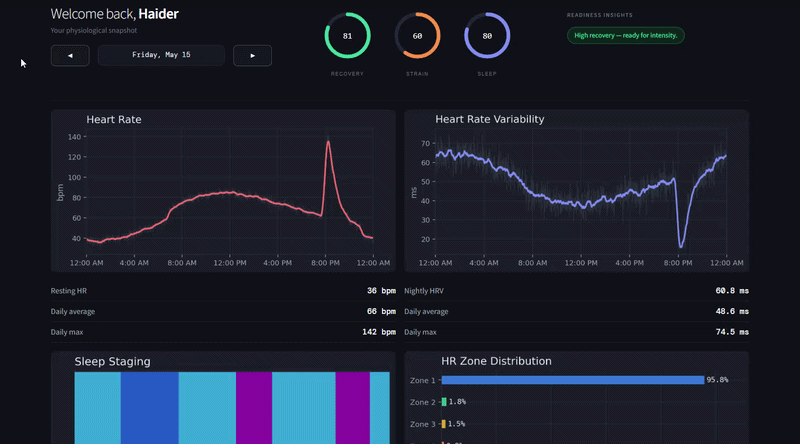

# Wearable Analytics Engine

The system simulates a realistic wearable analytics stack and demonstrates how continuous biosignals can be transformed into decision-ready metrics.

---

## Demo

---

## Overview

This project implements an end-to-end wearable data pipeline:

- Synthetic physiological signal generation
- Signal preprocessing and smoothing
- Feature engineering for daily health metrics
- Scoring system for recovery, sleep, and strain
- Interactive Streamlit dashboard for exploration

The goal is to replicate the structure of a real-world wearable analytics system in a fully self-contained environment.

---

## Signal Generation

The synthetic data is designed to approximate real physiological behavior:

- Circadian heart rate rhythm
- Activity-driven cardiovascular response (lag + spike dynamics)
- Structured exercise events
- Sleep staging cycles (light / deep / REM)
- Coupled HRV response to cardiac load

This creates structured, noisy signals similar to wearable device outputs.

---

## Feature Engineering

Daily features are computed from smoothed time-series signals.

### Recovery Features
- Resting heart rate (sleep-based quantile)
- Nightly HRV

### Sleep Features
- Sleep duration
- Sleep efficiency
- REM / deep / light sleep distribution

### Activity Features
- Daily activity load
- Active minutes

### Cardiovascular Load
- Time spent in HR zones (Z1–Z5)
- Daily HR summary statistics

---

## Scoring System

The scoring layer converts physiological signals into interpretable metrics (0–100 scale).

### Sleep Score
Weighted combination of:
- Sleep duration
- Sleep efficiency
- REM percentage

### Recovery Score
Combines:
- Nightly HRV (positive contributor)
- Resting heart rate (inverse relationship)
- Sleep score

### Strain Score
Derived from time spent in heart rate zones:
- Higher zones contribute disproportionately more strain

---

## Dashboard

Built with Streamlit, the dashboard provides:

- Heart rate and HRV time series
- Sleep staging visualization
- HR zone distribution
- Activity signal tracking
- Daily score history
- Recovery / strain / sleep insights

The UI is designed to reflect a modern wearable analytics product experience.

---
